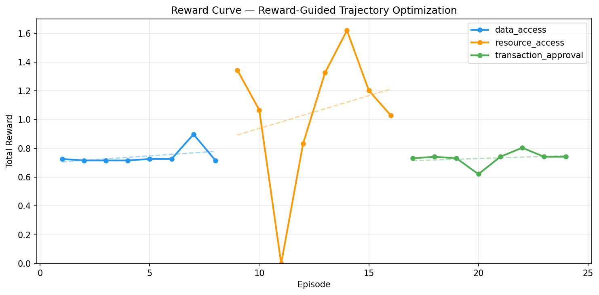
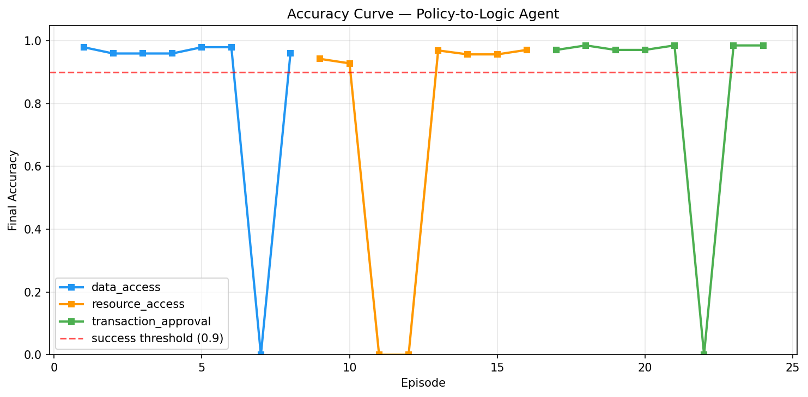
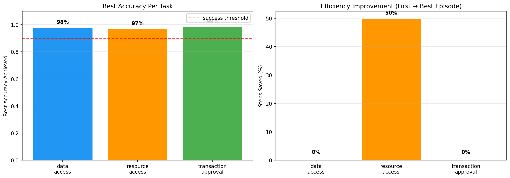

# Policy-to-Logic RL Environment

> A verifiable reinforcement learning environment for policy-to-logic reasoning,
> where an agent learns to iteratively convert natural language policies into
> executable rules through interaction and reward-guided optimization.

---

## 🔗 Deliverables

| Deliverable | Link |
|---|---|
| **HF Space (Live Environment)** | [godreign-policy2logic.hf.space](https://godreign-policy2logic.hf.space) |
| **Training Notebook (Colab)** | [Open in Colab](https://colab.research.google.com/github/GodreignElgin/policy2logic/blob/main/training/colab_training.ipynb) |
| **Writeup / Slides** | *TBD — add your link here* |
| **Experiment Tracking (W&B)** | [Wandb Project](https://wandb.ai/YOUR_USERNAME/policy-to-logic-rl) |

---

## 📊 Training Results

The agent is trained using a **reward-guided trajectory optimization loop**.
High-reward interaction sequences are accumulated as few-shot examples,
improving agent behavior across episodes without weight updates.

### Reward Curve


### Accuracy Curve


### Per-Task Improvement


---

## 📈 Experiment Tracking

All training runs are logged to Weights & Biases.
Metrics tracked per episode: total reward, final accuracy, steps used, success rate, few-shot examples used.

Live dashboard: [wandb.ai/YOUR_USERNAME/policy-to-logic-rl](https://wandb.ai/YOUR_USERNAME/policy-to-logic-rl)

---

## 🧠 What This Is

This project builds a **verifiable RL environment** where:
- Policies are stated in natural language
- An agent converts them to executable JSON rules (DSL)
- The environment evaluates rules against generated scenarios
- Reward signals drive measurable improvement across episodes

**This is not a finished product. It is a training and evaluation framework.**

---

## 🏗️ Architecture

```
Policy → Agent → (Ask / Propose / Refine)
       → Environment → (Scenarios + Evaluation)
       → Reward → Trajectory Bank → Improved Agent
```

### Three Tasks (increasing difficulty)

| Task | Difficulty | Variables | Decisions |
|---|---|---|---|
| data_access | Easy | time, data_type | ALLOW, DENY |
| resource_access | Medium | role, time, document_type | ALLOW, DENY |
| transaction_approval | Hard | amount, transfer_type, time, role | APPROVE, REQUIRE_APPROVAL, COMPLIANCE_REVIEW, HOLD |

---

## 🎮 Environment API

Live at: `https://godreign-policy2logic.hf.space`

| Endpoint | Method | Purpose |
|---|---|---|
| `/health` | GET | Health check |
| `/tasks` | GET | List available tasks |
| `/reset` | POST | Start new episode |
| `/step` | POST | Take action |
| `/state` | GET | Get episode state |

### Quick Start

```python
import requests

base = "https://godreign-policy2logic.hf.space"

# Start episode
result = requests.post(f"{base}/reset", json={"task_name": "data_access"}).json()
print(result["observation"]["policy_text"])

# Take action
action = requests.post(f"{base}/step", json={
    "action_type": "propose_rules",
    "content": '{"rules": [{"if": [{"field": "time", "op": ">=", "value": 9}, {"field": "time", "op": "<", "value": 18}], "then": "ALLOW"}], "default": "DENY"}'
}).json()
print(f"Reward: {action['reward']}, Accuracy: {action['observation']['current_accuracy']}")
```

---

## 🔁 Training Loop

The training approach uses **reward-guided trajectory accumulation**:

1. Agent runs episode zero-shot
2. High-reward trajectories stored in trajectory bank
3. Next episode uses top-K trajectories as few-shot context
4. Agent performance improves as bank accumulates better examples

**This is a legitimate policy improvement loop driven by environment reward signal.**

### Run Training Locally

```bash
# Install dependencies
pip install openai requests matplotlib numpy

# Set environment variables
export HF_TOKEN=your_token_here
export ENV_BASE_URL=https://godreign-policy2logic.hf.space

# Run
python training/trajectory_optimizer.py
```

---

## 📁 Repository Structure

```
├── policy_to_logic_env/
│   ├── server/
│   │   ├── app.py              # FastAPI endpoints
│   │   ├── environment.py      # Core RL environment (reset/step/state)
│   │   ├── policies.py         # 3 task definitions
│   │   ├── ground_truth.py     # Ground truth + clarification oracle
│   │   ├── scenario_generator.py  # 4-strategy scenario generation
│   │   ├── dsl_engine.py       # JSON DSL parser and executor
│   │   ├── rewards.py          # Multi-component reward system
│   │   └── graders.py          # Rule evaluation
│   ├── models.py               # Pydantic data models
│   ├── client.py               # HTTP client library
│   └── openenv.yaml            # OpenEnv specification
├── training/
│   ├── trajectory_optimizer.py # Training loop
│   ├── colab_training.ipynb    # Colab notebook
│   └── plots/
│       ├── reward_curve.png    # Training evidence (committed)
│       ├── accuracy_curve.png  # Training evidence (committed)
│       └── improvement_chart.png
├── main.py                     # Server entry point
├── Dockerfile                  # HF Spaces deployment
└── README.md                   # This file
```

---

## ⚙️ OpenEnv Compliance

This environment implements the OpenEnv specification:
- Gym-style `reset()` / `step()` / `state()` interface
- Valid `openenv.yaml` at `policy_to_logic_env/openenv.yaml`
- Pydantic models for all inputs/outputs
- HTTP API for remote agent interaction

---

## ⚠️ Known Limitations

1. Single-session server (sequential episodes only, not parallel)
2. Deterministic scenario seed — same scenarios every episode
3. Training loop uses trajectory accumulation, not weight updates
4. Clarification oracle is keyword-based, not semantic

---

## 🧾 Reward System

| Component | Weight | Signal |
|---|---|---|
| Accuracy | 50% | Rules correct vs ground truth |
| Improvement | 20% | Accuracy delta per step |
| Efficiency | 15% | Steps used vs budget |
| Clarification | 15% | Question usefulness |